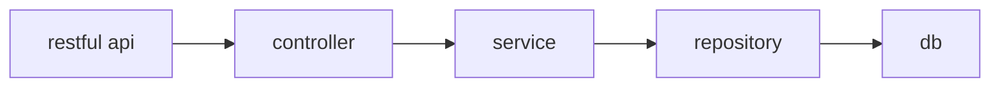
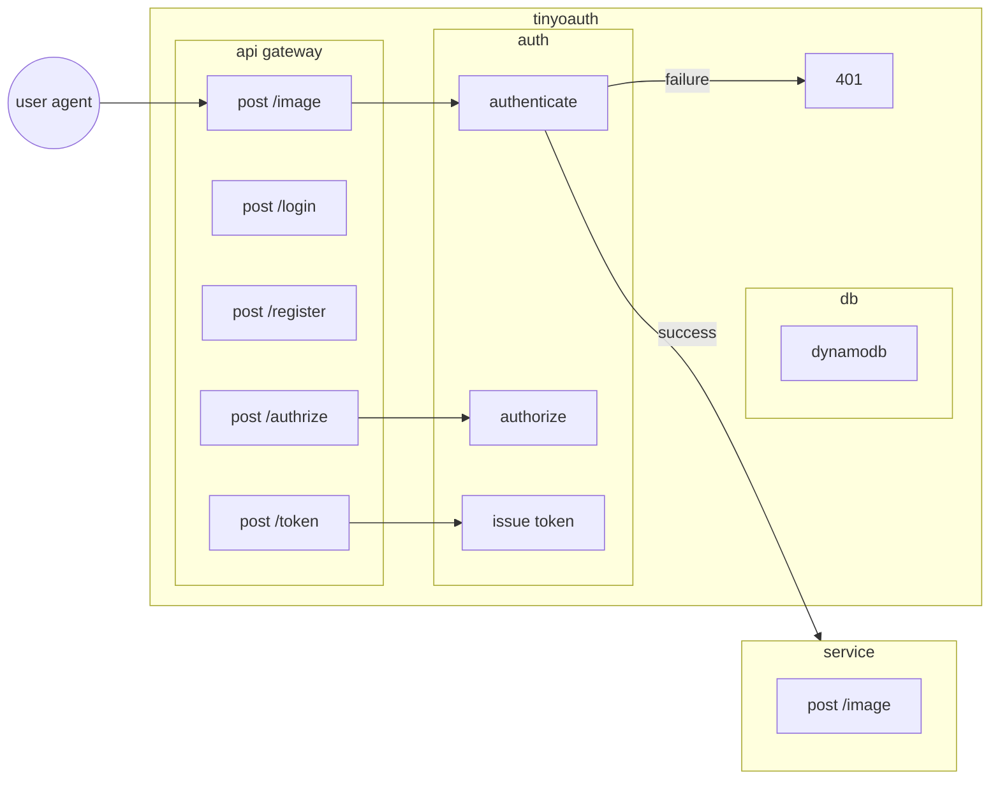

# Tinyoauth

a hostable api gateway that protects your api with oauth2.0

## Development guide

### Requirements

- node-16-lts
- docker

### Install

- npm install

### Test

- npm run test:unit
- npm run test:api

### Trunk-based development

#### Just push your commits!

There is no branch, no pull-request, you are allowed to make any changes and push it:

1. git pull --rebase
2. git add -p
3. git commit -m "xxx"
4. git push

## Architecture

### Serverless

## Design

### Api

