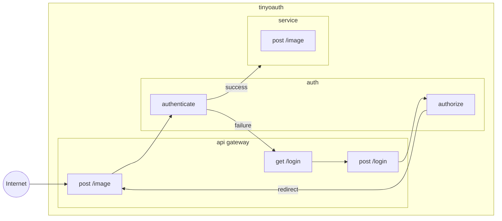

# Tinyoauth

a hostable api gateway that protects your api with oauth2.0

## Use cases

### Api protection

```mermaid
flowchart LR
  subgraph tinyoauth
    subgraph gateway[api gateway]
      post_image_api[post /image]
      get_login_api[get /login]
      post_login_api[post /login]
    end

    subgraph auth
      authenticate
      authorize
    end

    post_image_api --> authenticate
    authenticate -- success --> service
    authenticate -- failure --> get_login_api --> post_login_api --> authorize  -- "redirect" --> post_image_api

  end

  subgraph service
    service_api[post /image]
  end

  internet((Internet)) --> post_image_api
```

