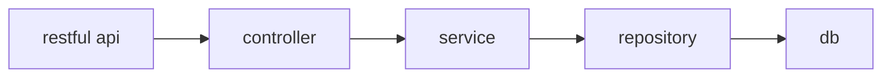
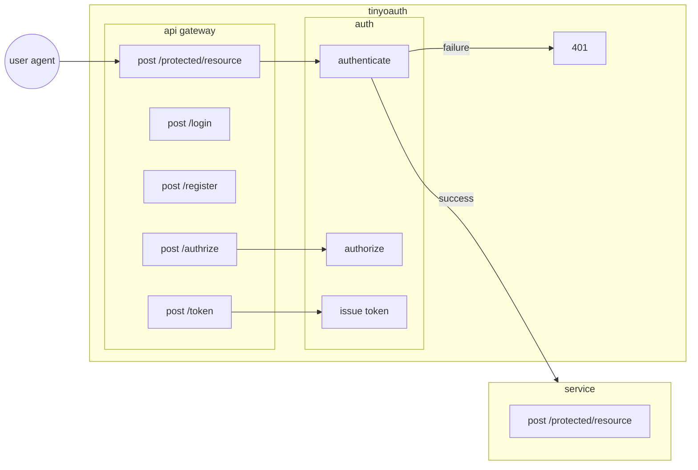
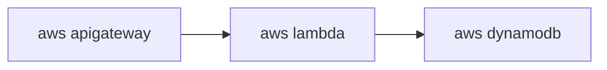
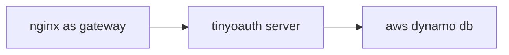

# Architecture

## Architecture style perspective

## Architecture dicisions perspective

### 1. Api design

### 2. Infrastructure

- serverless mode

- micro service mode

## Design principle perspective

WIP...

## Architecture characteristics perspective

WIP...
